# 프로젝트 기획

## 프로젝트 개요

| 프로젝트 명 | jelly |
| --- | --- |
| 주제 | 소규모 그룹의 친목 도모 및 추억 공유 커뮤니티 웹사이트 |
| 프로젝트 기간 | 5/22 ~ 6/16 |
| 발표 날짜 | 6/16 |
| 팀명 | 5공주 |

### 프로젝트 툴
- [노션](https://www.notion.so/hg-edu/10-5-6c06557e83784adc912fa3b12a1d42a7)

- [피그잼](https://www.figma.com/file/yIj9mmyghqyUOIEweIpMed/Untitled?type=design&node-id=0-1)

- [피그](https://www.figma.com/file/yIj9mmyghqyUOIEweIpMed/Untitled?type=design&node-id=0-1&t=0oySVFtLVJ5belTV-0)

## 기술 스택

	
	
  
  
  
	 
  
	
	
  
  

## 개발 역할 분담

| 이름 | 역할 | 세부 사항 |
| --- | --- |---|
| 조현영 | 조장님, 프론트엔드 개발 | accounts, post detail, vote, group create, navbar, sidebar |
| 최은비 | 프론트엔드 개발 | diary, group_detail, profile |
| 이수정 | 프론트엔드 개발 | index, schedule |
| 하성범 | 백엔드 개발 | accounts, diaries(ckeditor), chat(django-channel, redis), 배포(AWS, ubuntu) |
| 최수현 | 백엔드 개발 | groups(group, post, vote), 배포(AWS, ubuntu) |

## 주제 사전 조사 & 분석

[인스타](https://www.instagram.com/)

[페이스북](https://ko-kr.facebook.com/)

[네이버 밴드](https://band.us/)

[디스코드](https://discord.com/)

## 서비스 주요 기능

  
 회원관리 

  

    - 회원가입 
    - 로그인 
    - 로그아웃 
    - 프로필
  

 

 그룹 

  - 그룹 생성 & 관리(초대, 탈퇴, 방장위임 등) 
  - 그룹 레벨(그룹 활동 시 경험치 획득) 
  - 게시글(댓글 & 감정표현) 
  - 투표

 

채팅

  - 각 그룹별 채팅 기능(redis, django-channels사용)

 

다이어리

  - 개인 다이어리 
  - 그룹에 공유 
  - 댓글 & 감정표현 

 

스케줄

  - 개인 스케줄 관리
  - 그룹 스케줄 관리

 

## 모델(Model) 설계

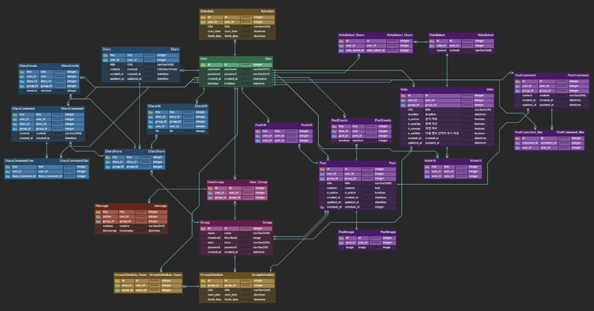

## 화면(Template) 설계

  
인덱스

  

  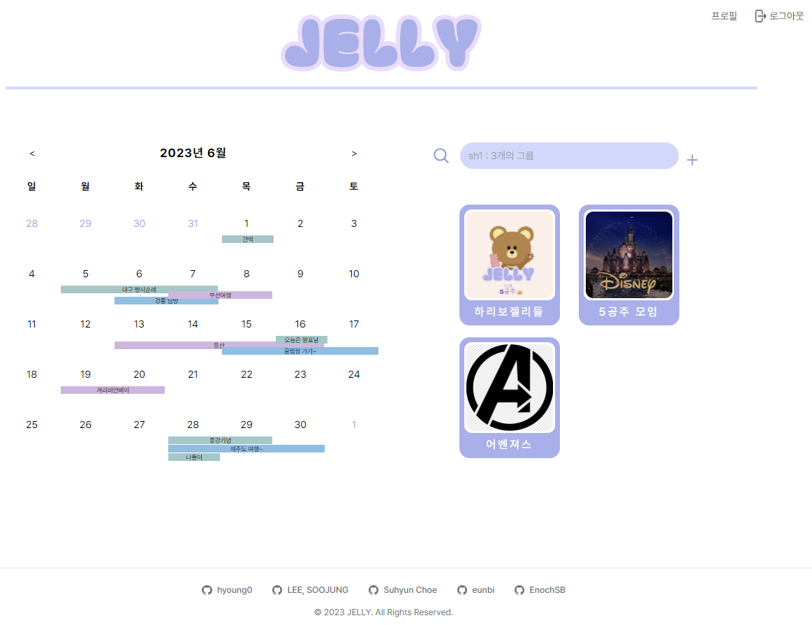
  

회원가입 / 로그인

  - 로그인
  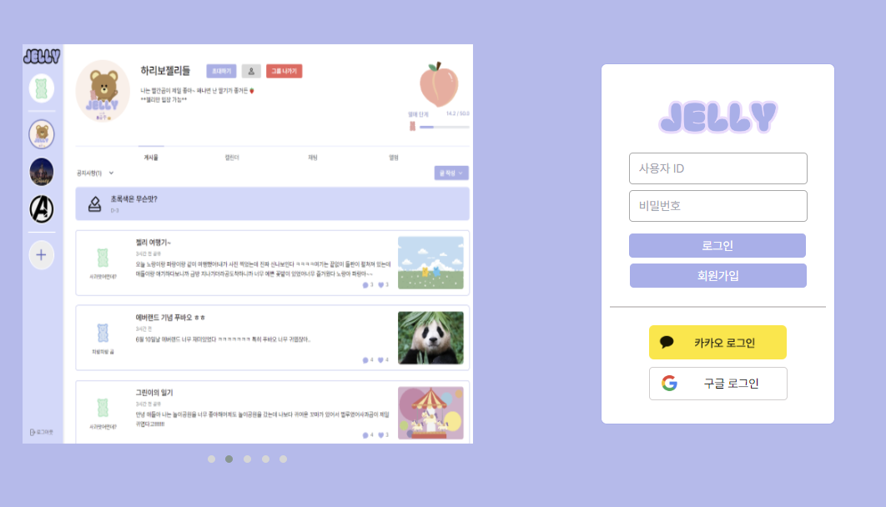
  - 회원가입
  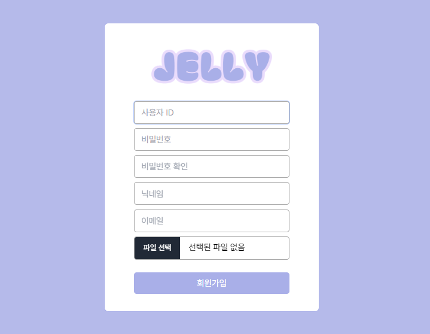
  - 프로필
  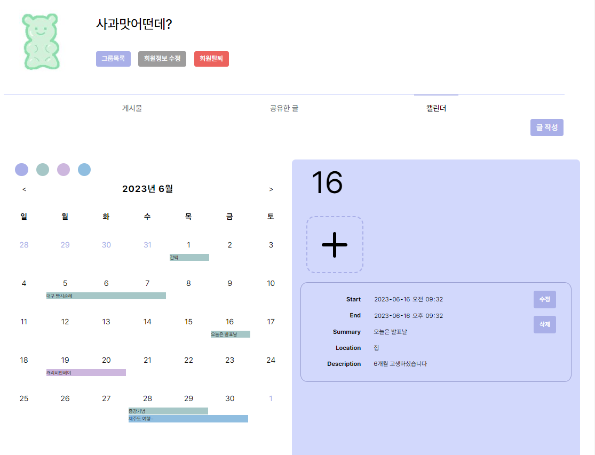

그룹

  - 그룹 가입
  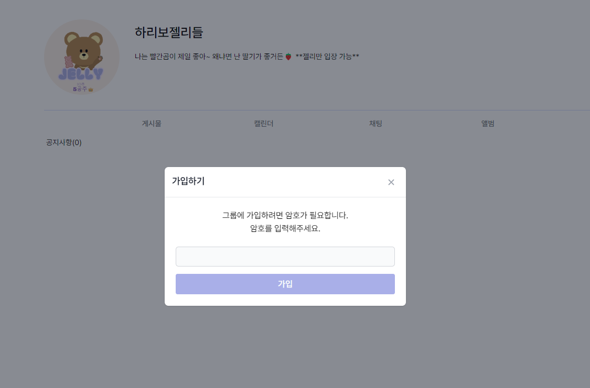
  - 메인
  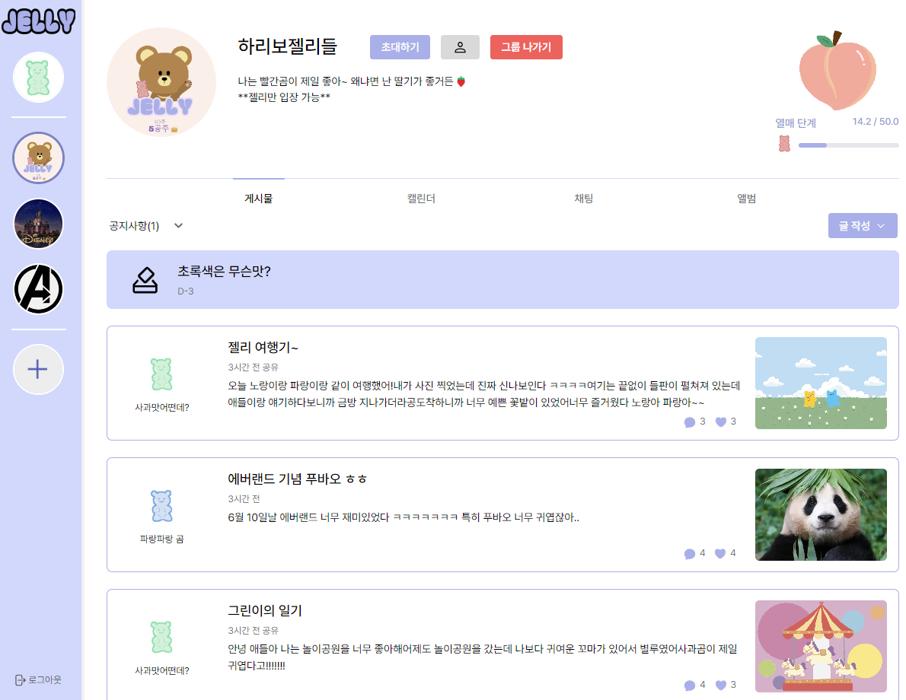
  - 스케줄
  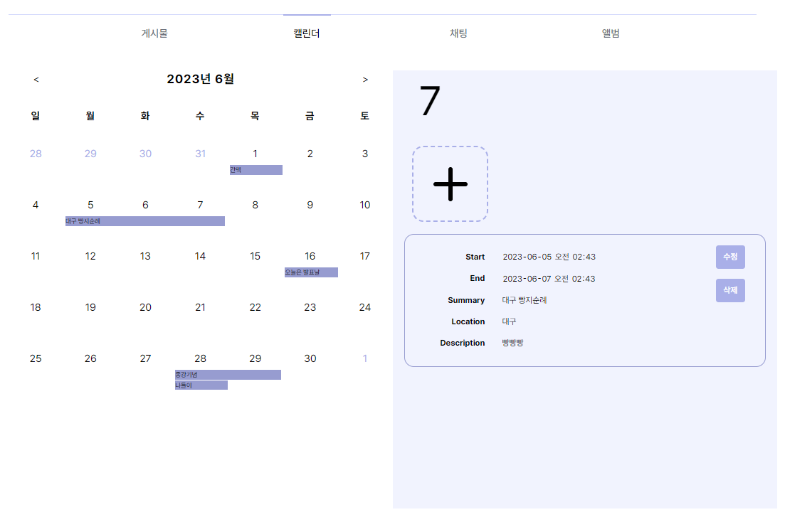
  - 채팅
  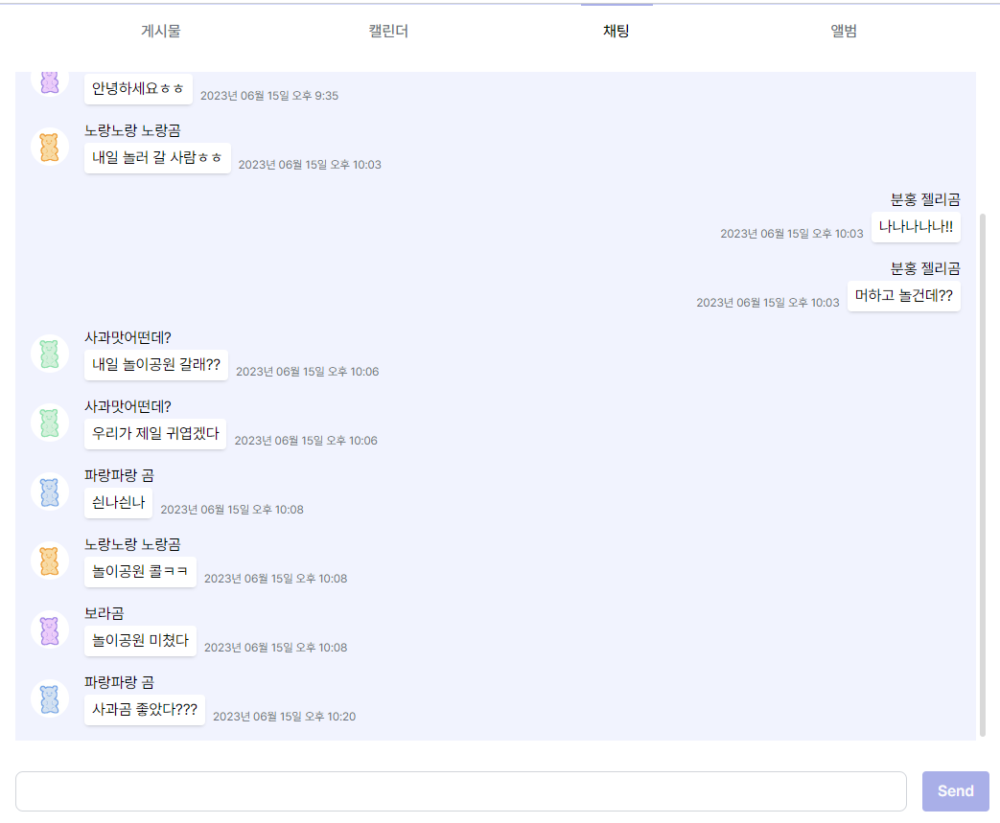
  - 앨범
  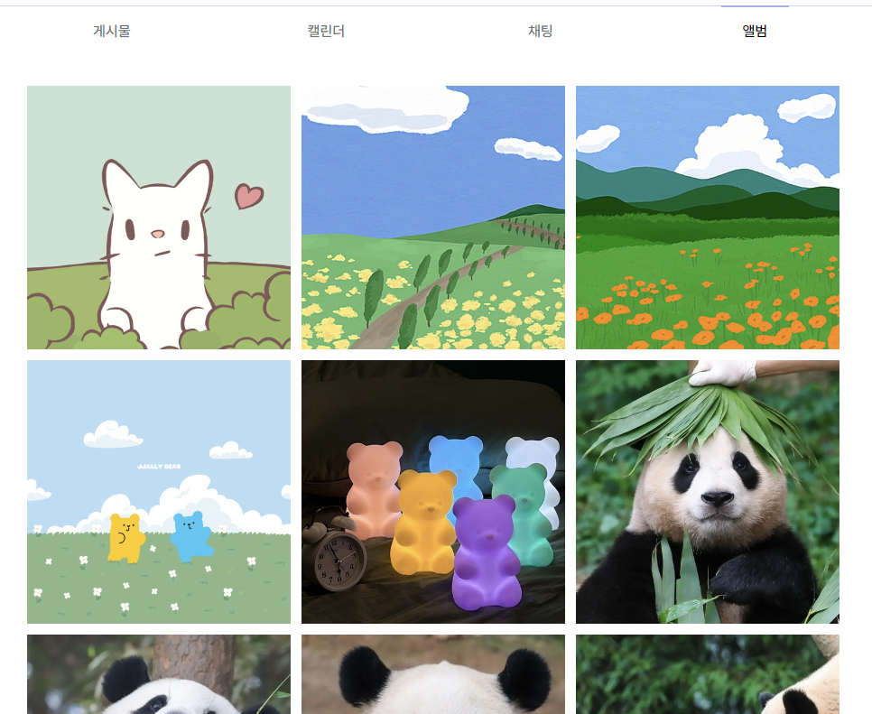
  - 그룹 레벨
  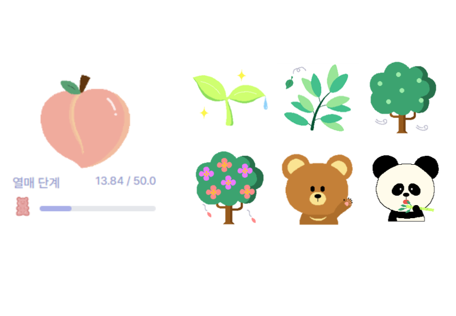

그룹 게시글 & 투표

  - 게시글
  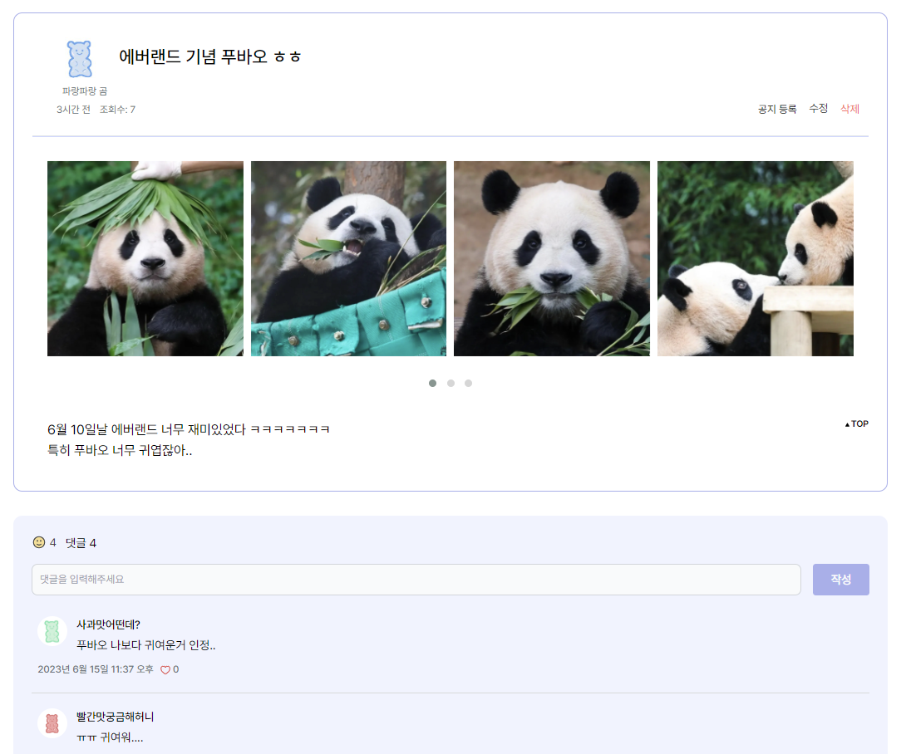
  - 참여한 투표
  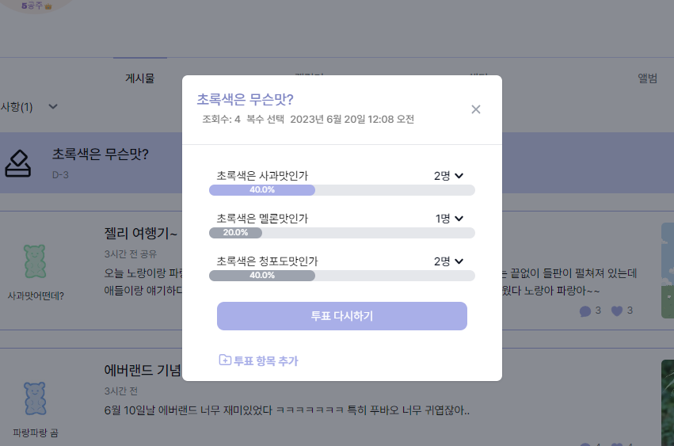
  - 참여하지 않은 투표
  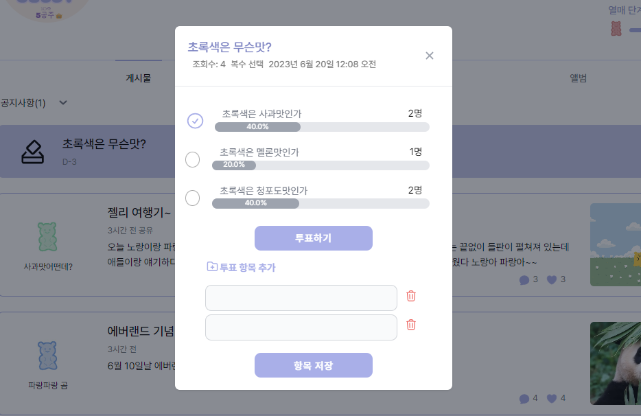

다이어리

  - 다이어리 작성
  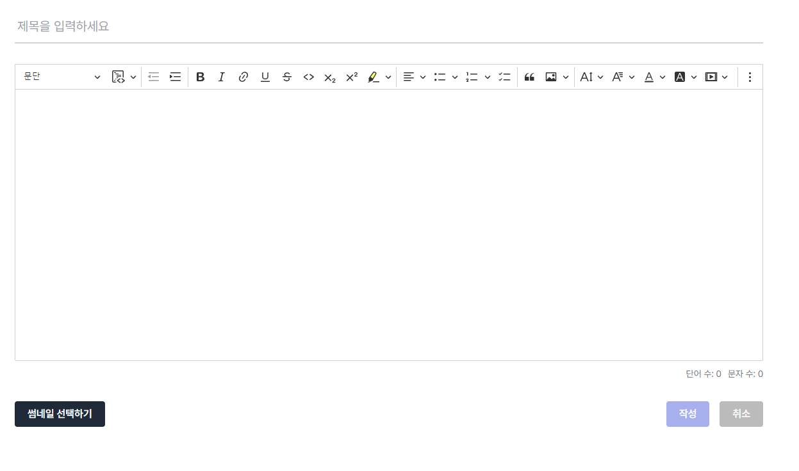
  - 다이어리 그룹 공유
  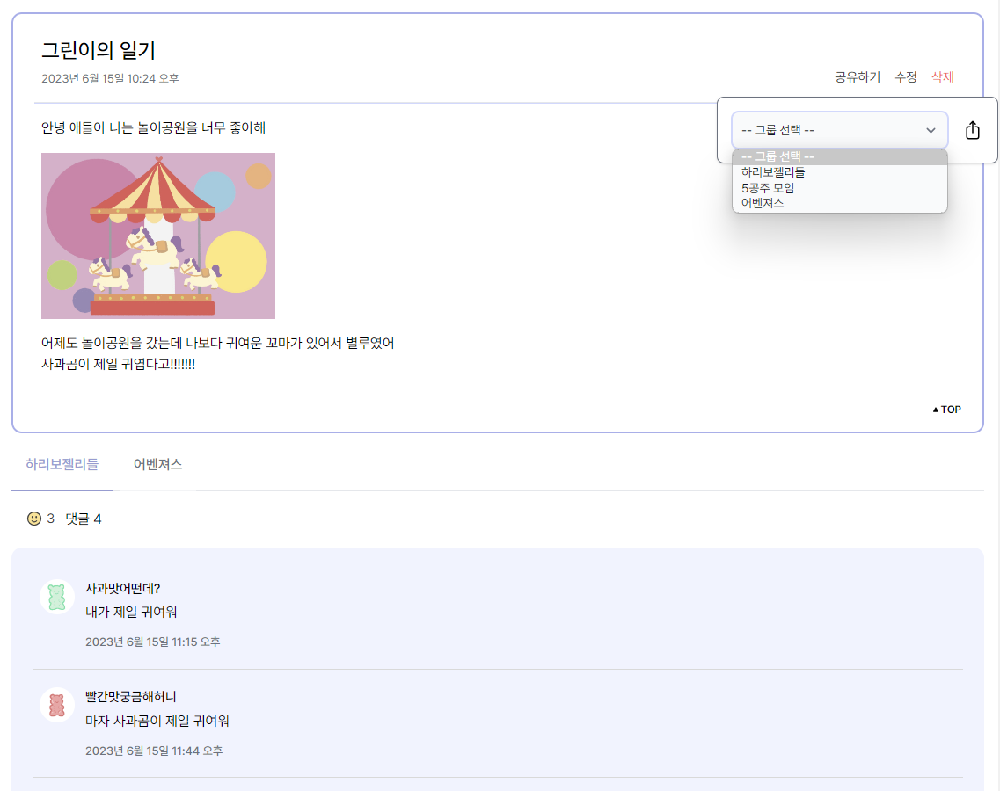

